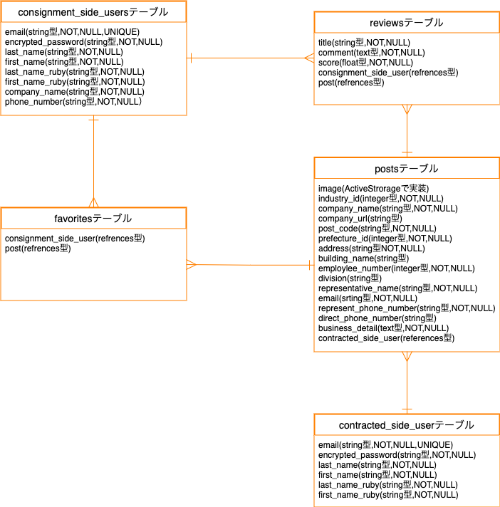

# 1.アプリケーション名

Assistance Company

# 2.アプリケーション概要
本アプリケーションは、協力会社検索サイトとなっております。外注先を探している方や、自社の情報を発信したい方に向けたサイトとなっております。本サイトは委託側と受託側でユーザーが分かれており、委託側は、会社を検索、お気に入り、レビューを行うことができます。受託側は、会社を投稿、編集、削除、検索を行うことができます。

# 3.URL
https://www.assistance-company.com/

# 4. ID/Pass

## 【BASIC認証】
- ID：admin
- password：a12345

## 【テスト用アカウント】
委託側(consignment_side_users)
- ID：consignment_test@test.com
- password：a12345

受託側(contracted_side_users)
- ID：contracted_test@test.com
- password：a12345

# 5.利用方法
- WebブラウザGoogle Chromeの最新版を利用してアクセスしてください。
 ※ただしデプロイ等で接続できないタイミングもございます。その際は少し時間をおいてから接続してください。
- 音声検索機能を使用する際は、マイクの使用を許可してください

# 6.目指した課題解決
## 【経緯】
私は前職で設計会社に勤めており、殆どの業務において協力会社に仕事を外注してました。外注先は技術力の高い会社である必要があったため、常に固定化されている状況にありました。そのため、いつも委託している外注先が手一杯の場合に頼める会社が他にないという課題がありました。そういった課題を解決するため、会社を検索できるアプリケーションの作成を行いました。

## 【ペルソナ】
- 性別と年齢：20代〜40代（男女）
- 職業：（会社員及び個人事業主）

# 7.機能設計

## 【ユーザー管理機能】
- devise(registration,session)
- consignment_side_users：委託側
- contracted_side_users：受託側
- マイページ（ヘッダーのユーザー名をクリック）

## 【会社投稿機能】
Authority：contracted_side_users
- 一つの会社から部署毎に複数の投稿を行うことを想定
- 画像ファイルアップロード
- 規模が小さい会社や個人事業主も使用すると考えられるため、URLや建物名、部署、電話番号（直通）は任意入力

## 【会社一覧表示機能】
Authority：all_users
- トップページに、投稿新着順に20社のみ（検索を前提）

## 【会社投稿詳細表示機能】
Authority：all_users
- 投稿された全ての情報、星レビュー平均点を表示
- URLをクリックすると、該当ページへ遷移（新しいページ）
 ※ログイン状況により表示ボタンが異なる
 consignment_side_users：お気に入り、星レビュー
 contracted_side_users：投稿編集、削除

## 【会社投稿編集・削除機能】
Authority：contracted_side_users
- 詳細画面より編集、削除可能

## 【会社検索機能】
Authority：all_users
- 絞り込み検索（業種、都道府県、キーワード）
- 音声検索（Web Speech API）

## 【お気に入り投稿・削除機能】
Authority：consignment_side_users
- 詳細画面よりお気に入り登録可能
- 登録したお気に入りはマイページに一覧表示

## 【星レビュー投稿・編集・削除・一覧表示機能】
Authority：consignment_side_users
- ★1~★5を選択
 ※評価対象が会社であるため、★1以上とし一定の評価を担保
- レビュータイトル、本文

## 【単体テスト機能】
実施事項
- ユーザー管理機能（新規登録）
- 会社投稿機能
- 星レビュー投稿機能

# 8. DB設計

## 【ER図】

## consignment_side_usersテーブル

|Column              |Type     |Options                    |
|--------------------|---------|---------------------------|
| email              | string  | null: false, unique: true |
| encrypted_password | string  | null: false               |
| last_name          | string  | null: false               |
| first_name         | string  | null: false               |
| last_name_ruby     | string  | null: false               |
| first_name_ruby    | string  | null: false               |
| company_name       | string  | null: false               |
| phone_number       | string  | null: false               |

### Association
- has_many :favorites
- has_many :posts, through: :favorites

## contracted_side_usersテーブル

|Column              |Type     |Options                    |
|--------------------|---------|---------------------------|
| email              | string  | null: false, unique: true |
| encrypted_password | string  | null: false               |
| last_name          | string  | null: false               |
| first_name         | string  | null: false               |
| last_name_ruby     | string  | null: false               |
| first_name_ruby    | string  | null: false               |

### Association
- has_many :posts

## postsテーブル

|Column                  |Type        |Options                         |
|------------------------|------------|--------------------------------|
| industry_id            | integer    | null: false                    |
| company_name           | string     | null: false                    |
| company_url            | string     |                                |
| post_code              | string     | null: false                    |
| prefecture_id          | integer    | null: false                    |
| address                | string     | null: false                    |
| building_name          | string     |                                |
| employee_number        | integer    | null: false                    |
| division               | string     |                                |
| representative_name    | string     | null: false                    |
| email                  | string     | null: false                    |
| represent_phone_number | string     | null: false                    |
| direct_phone_number    | string     |                                |
| business_detail        | text       | null: false                    |
| contracted_side_user   | references | null: false, foreign_key: true |

### Association
- belongs_to :contracted_side_user
- has_many :favorites
- has_many :consignment_side_users, through: :favorites

## favoritesテーブル

|Column                 |Type        |Options                         |
|-----------------------|------------|--------------------------------|
| consignment_side_user | references | null: false, foreign_key: true |
| post                  | references | null: false, foreign_key: true |

### Association
- belongs_to :consignment_side_user
- belongs_to :post

## reviewsテーブル

|Column                 |Type        |Options                         |
|-----------------------|------------|--------------------------------|
| title                 | string     | null: false                    |
| comment               | text       | null: false                    |
| score                 | float      | null: false                    |
| consignment_side_user | references | null: false, foreign_key: true |
| post                  | references | null: false, foreign_key: true |

### Association
- belongs_to :consignment_side_user
- belongs_to :post

# 9.開発環境、インフラ
- macOS
- Visual Studio Code
- Ruby(2.7.2)
- Ruby on Rails (6.1.3.1)
- AWS (EC2, Route53, Certificate Manager)
- Nginx
- Unicorn
- MariaDB
- Git/GitHub
